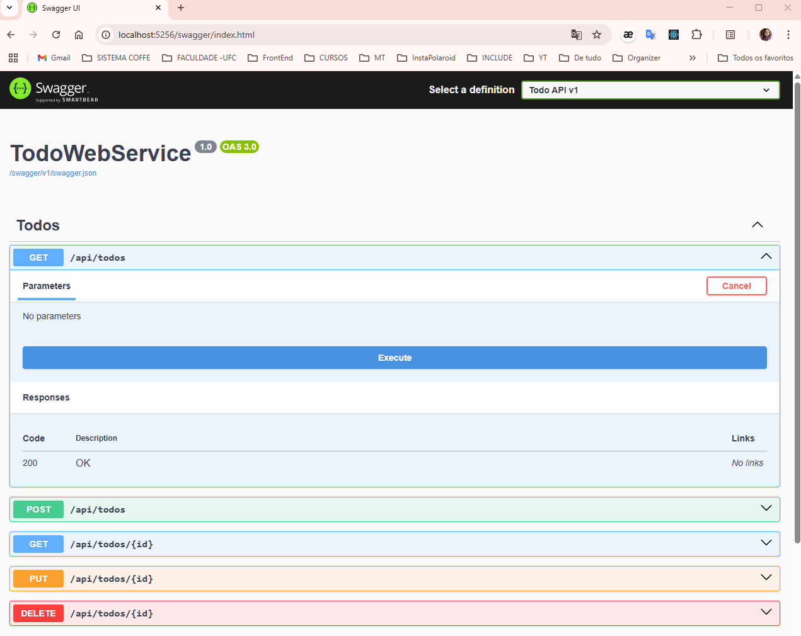
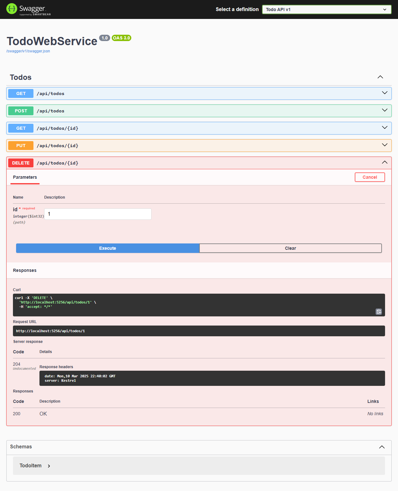
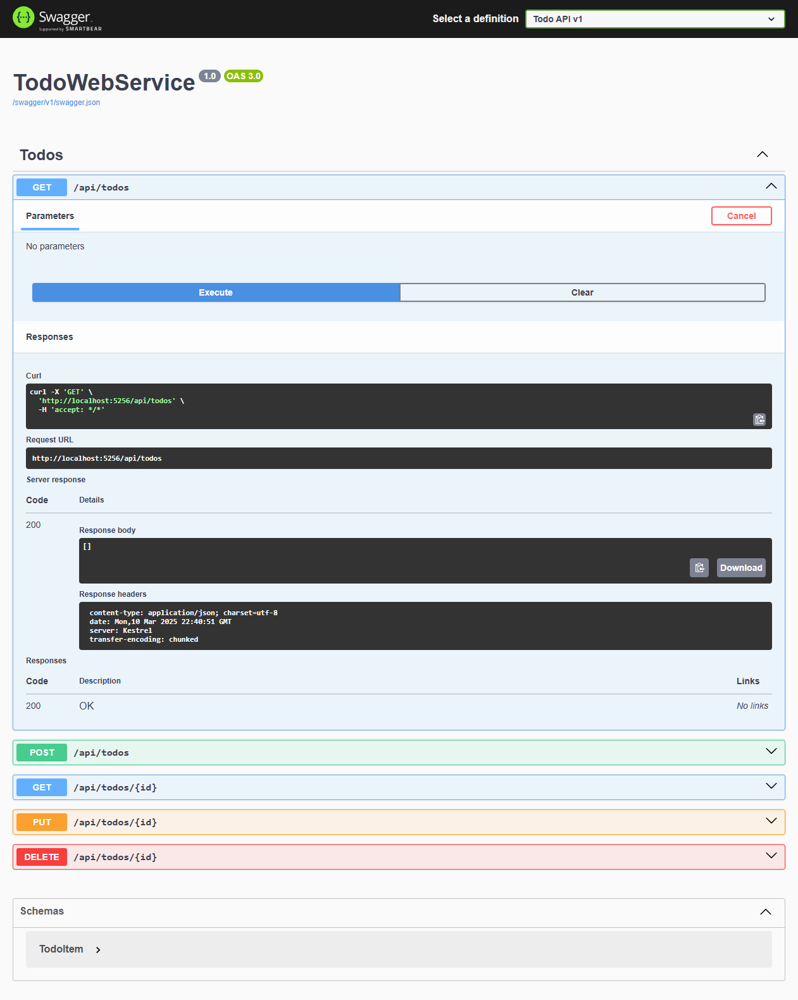
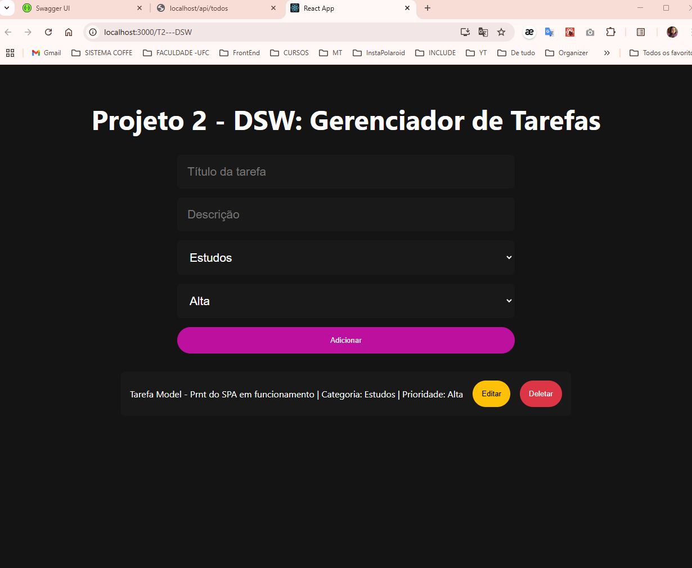

# T3 - Backend DSW
Web service para gerenciar tarefas da SPA React.

## Como Rodar
- **Local**: 
  - Backend: `dotnet run` (na pasta `C:\Users\nivea\Downloads\TodoWebService`)
  - Frontend: `npm start` (na pasta `D:\Área de Trabalho\projeto2-dsw`)
- Acesse: `http://localhost/api/todos` (Backend) / `http://localhost:3000` (Frontend)
- **Docker**: Configurado, mas enfrentou problemas de conexão com o daemon no ambiente local (pendente).

## Endpoints
- GET /api/todos: Listar
- POST /api/todos: Inserir
- PUT /api/todos/{id}: Atualizar uma tarefa existente
- DELETE /api/todos/{id}: Deletar

## Evidências
As evidências estão organizadas na pasta `assets/`:
- ---
-  - Listagem vazia antes de inserir tarefas
-  - Criação de uma tarefa
-  - Atualização de uma tarefa
-  - Exclusão de uma tarefa
-  - Listagem vazia após deletar todas as tarefas
-  - Interface da SPA com uma tarefa adicionada

## Sequência da SPA
Veja a sequência completa de uso da SPA em: [Apresentação SPA](assets/Apresentacao_SPA_Niveah4_500028.pdf)